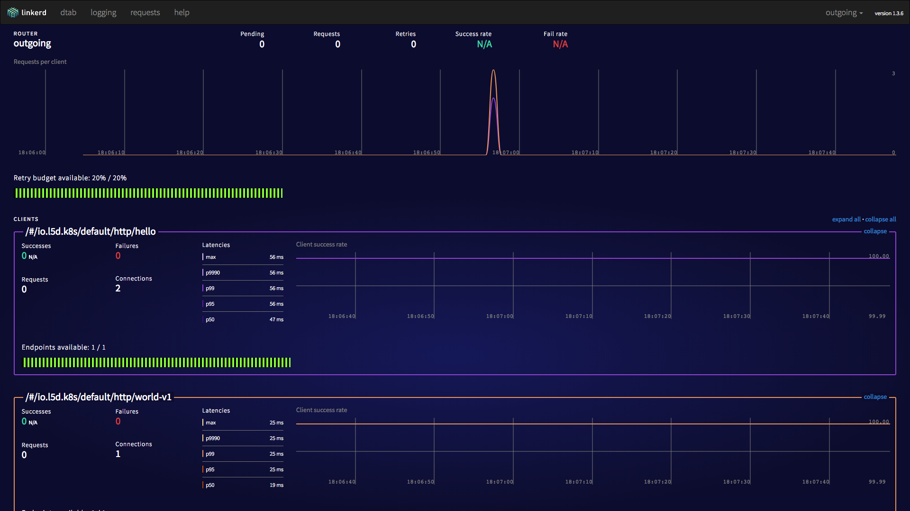

# kubernetes-guide

## Start Local

```bash
# Start the local minikube with RBAC enabled
$ minikube start --extra-config=apiserver.Authorization.Mode=RBAC

# Use local docker image
$ eval $(minikube docker-env)

# OR

$ make start
```


## Steps

- Create Namespace
- Create ServiceAccount


## Get Contexts

```bash
$ kubectl config get-contexts
```

Output:

```
CURRENT   NAME       CLUSTER    AUTHINFO   NAMESPACE
*         minikube   minikube   minikube
```


## Switch Contexts

```bash
$ kubectl config set-context $(kubectl config current-context) --namespace=${NAMESPACE}
Context "minikube" modified.
```

Output:

```bash
$ kubectl config get-contexts
CURRENT   NAME       CLUSTER    AUTHINFO   NAMESPACE
*         minikube   minikube   minikube   dev
```


## Deploy Linkerd

```bash
# Create accounts
$ kubectl create -f accounts/default.yml

# Create namespace
$ kubectl create -f namespaces/linkerd.yml

# Create roles
$ kubectl create -f roles/linkerd.yml

# Create linkerd services
$ kubectl create -f services/linkerd --record

# Create services that calls linkerd
$ kubectl create -f services/helloworld --record

## All-in-one
$ kubectl apply -f accounts -f roles -f services/linkerd -f services/helloworld --record
```

Output:

```bash
Warning: kubectl apply should be used on resource created by either kubectl create --save-config or kubectl apply
serviceaccount "default" configured
serviceaccount "john" configured
clusterrole.rbac.authorization.k8s.io "linkerd-endpoints-reader" configured
clusterrole.rbac.authorization.k8s.io "namerd-dtab-storage" configured
clusterrolebinding.rbac.authorization.k8s.io "linkerd-role-binding" configured
clusterrolebinding.rbac.authorization.k8s.io "namerd-role-binding" configured
configmap "l5d-config" configured
daemonset.extensions "l5d" created
service "l5d" created
deployment.apps "hello" created
service "hello" created
deployment.apps "world-v1" created
service "world-v1" created
```

## Test Linkerd

```bash
$ make l5d-test
```

Output:

```bash
Hello (172.17.0.9) world (172.17.0.12)!!http_proxy=http://192.168.99.100:30891 curl -s http://hello
Hello (172.17.0.9) world (172.17.0.10)!!http_proxy=http://192.168.99.100:30891 curl -s http://world
world (172.17.0.12)!%
```

