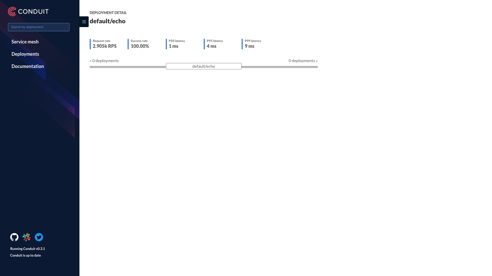

# kubernetes-guide

## Start Local

```bash
# Start the local minikube with RBAC enabled
$ minikube start --extra-config=apiserver.Authorization.Mode=RBAC

# Use local docker image
$ eval $(minikube docker-env)

# OR

$ make start
```


## Steps

- Create Namespace
- Create ServiceAccount


## Get Contexts

```bash
$ kubectl config get-contexts
```

Output:

```
CURRENT   NAME       CLUSTER    AUTHINFO   NAMESPACE
*         minikube   minikube   minikube
```


## Switch Contexts

```bash
$ kubectl config set-context $(kubectl config current-context) --namespace=${NAMESPACE}
Context "minikube" modified.
```

Output:

```bash
$ kubectl config get-contexts
CURRENT   NAME       CLUSTER    AUTHINFO   NAMESPACE
*         minikube   minikube   minikube   dev
```


## Deploy Linkerd

```bash
# Create accounts
$ kubectl create -f accounts/default.yml

# Create namespace
$ kubectl create -f namespaces/linkerd.yml

# Create roles
$ kubectl create -f roles/linkerd.yml

# Create linkerd services
$ kubectl create -f services/linkerd --record

# Create services that calls linkerd
$ kubectl create -f services/helloworld --record

## All-in-one
$ kubectl apply -f accounts -f roles -f services/linkerd -f services/helloworld --record
```

Output:

```bash
Warning: kubectl apply should be used on resource created by either kubectl create --save-config or kubectl apply
serviceaccount "default" configured
serviceaccount "john" configured
clusterrole.rbac.authorization.k8s.io "linkerd-endpoints-reader" configured
clusterrole.rbac.authorization.k8s.io "namerd-dtab-storage" configured
clusterrolebinding.rbac.authorization.k8s.io "linkerd-role-binding" configured
clusterrolebinding.rbac.authorization.k8s.io "namerd-role-binding" configured
configmap "l5d-config" configured
daemonset.extensions "l5d" created
service "l5d" created
deployment.apps "hello" created
service "hello" created
deployment.apps "world-v1" created
service "world-v1" created
```

## Test Linkerd

```bash
$ make l5d-test
```

Output:

```bash
Hello (172.17.0.9) world (172.17.0.12)!!http_proxy=http://192.168.99.100:30891 curl -s http://hello
Hello (172.17.0.9) world (172.17.0.10)!!http_proxy=http://192.168.99.100:30891 curl -s http://world
world (172.17.0.12)!%
```


## Conduit

### Installation

```bash
$ conduit install | kubectl apply -f -
```

Output:

```bash
namespace "conduit" created
serviceaccount "conduit-controller" created
clusterrole.rbac.authorization.k8s.io "conduit-controller" created
clusterrolebinding.rbac.authorization.k8s.io "conduit-controller" configured
serviceaccount "conduit-prometheus" created
clusterrole.rbac.authorization.k8s.io "conduit-prometheus" created
clusterrolebinding.rbac.authorization.k8s.io "conduit-prometheus" configured
service "api" created
service "proxy-api" created
deployment.extensions "controller" created
service "web" created
deployment.extensions "web" created
service "prometheus" created
deployment.extensions "prometheus" created
configmap "prometheus-config" created
service "grafana" created
deployment.extensions "grafana" created
configmap "grafana-config" created
configmap "grafana-dashboards" created
```

### Check

```bash
$ conduit check
```

Output:

```bash
kubernetes-api: can initialize the client.......................................[ok]
kubernetes-api: can query the Kubernetes API....................................[ok]
kubernetes-api: is running the minimum Kubernetes API version...................[ok]
conduit-api: can query the Conduit API..........................................[ok]
conduit-api[telemetry]: control plane can use telemetry service.................[ERROR] -- Error talking to telemetry service from control plane: rpc error: code = Unknown desc = Get http://prometheus.conduit.svc.cluster.local:9090/api/v1/query?query=reports_total%5B30s%5D: dial tcp: i/o timeout
conduit-version: cli is up-to-date..............................................[ok]
conduit-version: control plane is up-to-date....................................[ok]

Status check results are [ERROR]
```

### Dashboard

```bash
# Hint open the dashboard immediately to prevent the issue above from happening
$ conduit dashboard
```

Output:

```bash
Conduit dashboard available at:
http://127.0.0.1:49646/api/v1/namespaces/conduit/services/web:http/proxy/
Opening the default browser
Starting to serve on 127.0.0.1:49646
```

### Deployment

```bash
$ conduit inject services/echo-conduit/deployment.yml | kubectl apply -f -
```

### Delete

```bash
$ conduit install | kubectl delete -f -
```

### Stats

```bash
$ conduit stat deployments
$ conduit tap deploy echo
```



## Linkerd Ingress

```bash
# Enable Ingress
$ minikube addons enable ingress

$ kubectl create ns l5d-system
$ kubectl apply -f services/linkerd-ingress

# Port-forward ui
# $ kubectl port-forward l5d-rhbrr 9990:9990

# In minikube, external load balancer support is unavailable, use hostIP
HOST_IP=$(kubectl get po -l app=l5d -o jsonpath="{.items[0].status.hostIP}")
L5D_SVC_IP=$HOST_IP:$(kubectl get svc l5d -o 'jsonpath={.spec.ports[0].nodePort}')
curl http://$L5D_SVC_IP
open http://$HOST_IP:$(kubectl get svc l5d -o 'jsonpath={.spec.ports[1].nodePort}')

# Log the linkerd pods
$ kubectl logs $(kubectl get po -l app=l5d  -o jsonpath='{.items[0].metadata.name}') l5d

# Test
$ curl -H "Host: world.v2" http://$L5D_SVC_IP
world (172.17.0.16)!%
```

### Ingress

```bash
$ kubectl get ingress
NAME          HOSTS      ADDRESS   PORTS     AGE
hello-world   world.v2             80        11m
```